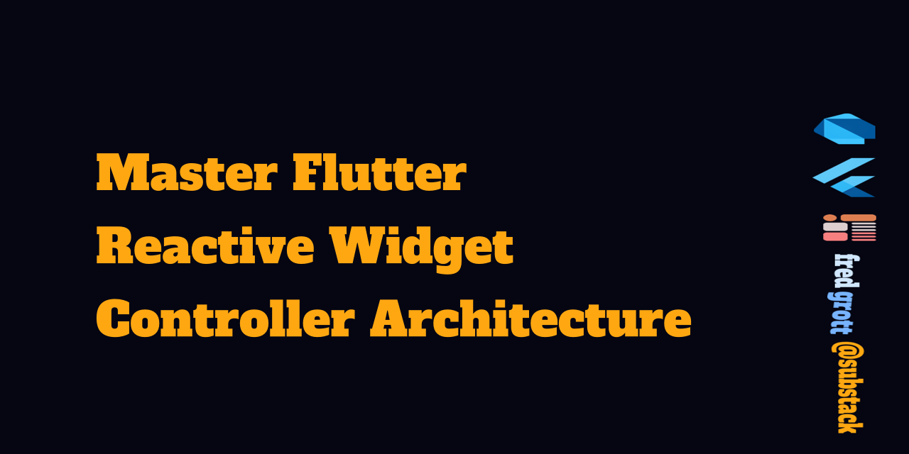

# Master Flutter Reactive Widget Controller Architecture

Combines Reactive Stores of Observables, Observers, Actions and Reactions with Flutter framework widget controllers.

What? No Use Case boilerplate BS? Nope! No repositories and datasources? Nope, why add extra useless abstraction!

With RxDart you had to write a lot more as you had to implement the wiring to every observer and its relaionship to each view of interest. With my approach you do not. I call it putting the fun back into designing and building Flutter apps!

## Why Not Async Redux, Rx Notifiers, RxDart?

All those solutions require you to do a lot of boilerplate and wiring of observers.

## Terms

Widget-Controller-Stateless and Stateful Widgets, the Flutter framework puts state control of the view in these widgets. Usually organized into feature-screens and common components.

Observables-Models, data classes are non collection simple models and value classes are complex collection models. Keep in mind that as of late 2024 the dart computer language supply those classes so we have to use packages to implement them.

Atoms-Observers

Actions-Business logic actions on observables and since we store these in their stores we do not need to repeat abstraction boilerplate use cases anymore.

Reactions-Listening to actions and doing a reaction to such actions

Stores-The class that holds the observable reference, observers, acttions and reactions.

Services-Service classes that usually is a remote API datasource access, service locator to inject dependencies, logging, localization, etc.

TRFP-Trensparent Reactive Functional Programming, while Facebook's experimental Recoil is full TRFP, this RWC arch is as close to full TRFP as possible using the Flutter framework and some reactive packages.

Algebraic Data Types-Dart uses a mixed class and functional approach to TRFP. Some of this is via  Sealed Classes, Pattern, and Records, etc to implement algebraic data types.

Async Programming-Dart's reactive programming is via streams and sinks.

## Articles

So I started my flutter substack to create flutter newsletter articles discusing design and code approaches. But, its more than that in that if you become a paid member you get to interact and ask questions and get actual useful answers:

[Fred Grott's Flutter Substack NewsLetter](https://fregrott.substack.com)

